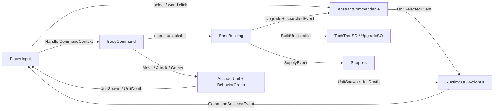
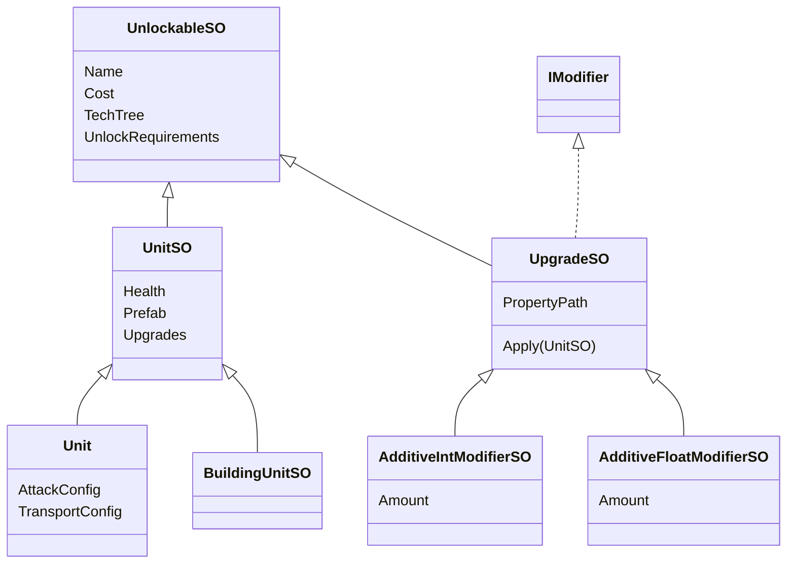
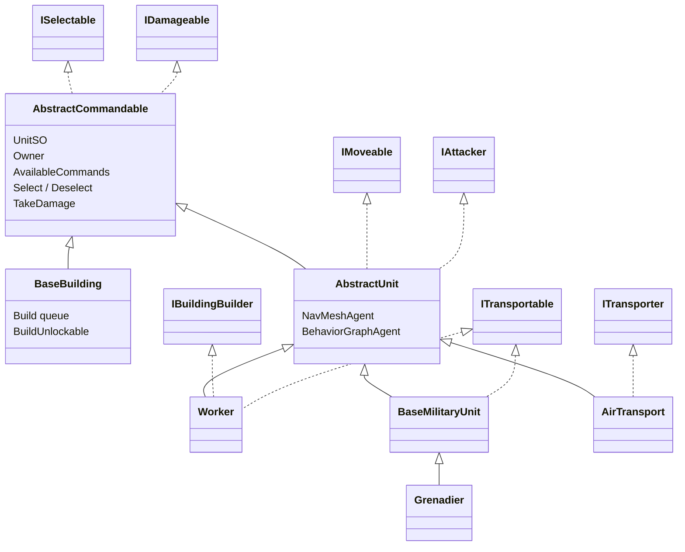
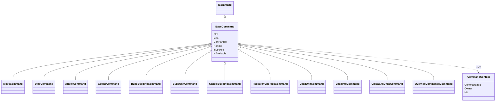
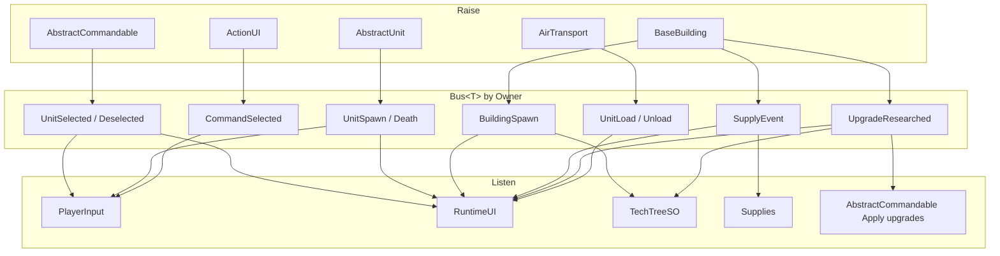
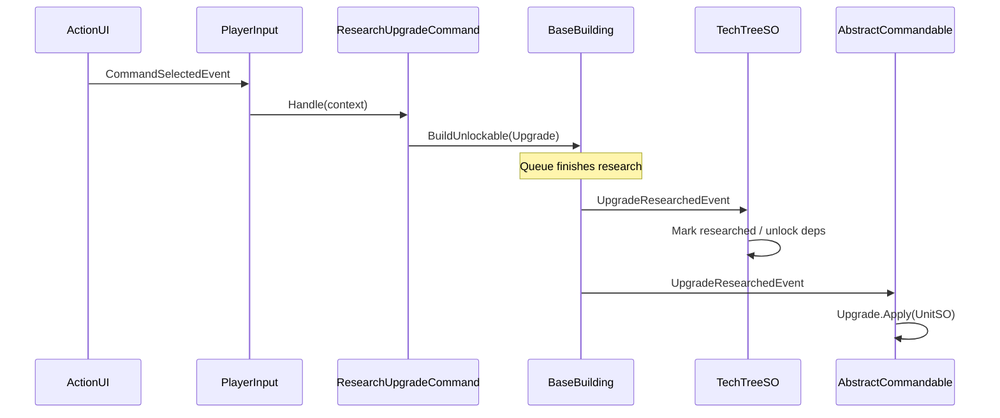
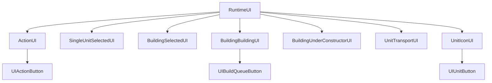

# RTS_Course

Unity RTS course project: units, buildings, commands, tech tree upgrades, owner-scoped events, and runtime UI.

Also includes **Gumiho Editor Tool** — a custom Unity inspector with tabs, title groups, buttons, and collection drawers. Inherit `GumihoBehaviour` and use attributes from the `GumihoEditorTool` namespace.

---

## Script architecture

Runtime game code lives under `Assets/Scripts/`. Systems talk through **ScriptableObject data**, the **Command pattern**, and an **owner-scoped Event Bus**.

### Folder roles

| Folder | Role |
|--------|------|
| **Units** | Selectable / damageable entities, buildings, workers, military, transport; unit & building data SOs |
| **Commands** | `BaseCommand` ScriptableObject actions executed via `CommandContext` |
| **TechTree** | Unlockables, upgrades / modifiers, per-owner tech tree state |
| **EventBus** | Generic `Bus<T>` keyed by `Owner` |
| **Events** | Event payloads (`UnitSelectedEvent`, `SupplyEvent`, …) |
| **Player** | `PlayerInput` (selection, commands, camera), `Supplies` economy |
| **UI** | `RuntimeUI` + containers / components bound to selection & commands |
| **Behavior** | Unity Behavior Graph actions / conditions (move, attack, gather, build) |
| **Environment** | Gatherables / supply sources |
| **Utilities** | Comparers, animation constants |

---

### High-level system flow

1. **PlayerInput** tracks selection and issues the active command.
2. **UI** shows the intersection of `AvailableCommands` by slot; a click raises `CommandSelectedEvent`.
3. **Commands** drive units (Behavior Graph) or buildings (build / research queue).
4. **TechTree** unlocks from buildings / researched upgrades; commands check `IsUnlocked` / `IsResearched`.
5. **Upgrades** apply modifiers onto `UnitSO` data when researched (and again on spawn if already researched).

---

### Data inheritance (ScriptableObjects)

Related assets: `AttackConfigSO`, `TransportConfigSO`, `SupplyCostSO`, `TechTreeSO`.

---

### Runtime unit inheritance

---

### Command pattern

`AbstractCommandable.AvailableCommands` holds the SO command list the UI shows for the current selection.

---

### Event bus relationships

`Bus<T>` where `T : IEvents` — raise / subscribe per `Owner`.

Behavior Graph uses its own **EventChannels** (`GatherSuppliesEventChannel`, `BuildingEventChannel`, `LoadUnitEventChannel`) — separate from `Bus<T>`.

---

### Tech tree & upgrades

- **UnlockableSO** is shared by trainable units and researchable upgrades.
- Buildings queue either type; completion either spawns a unit or raises `UpgradeResearchedEvent`.
- Additive modifiers use reflection on `PropertyPath` (e.g. `AttackConfig/Damage`).

> **Note:** `Apply` mutates shared ScriptableObject data. If every alive unit handles `UpgradeResearchedEvent` and runs `+=`, the bonus stacks by unit count. Prefer apply-once globally, or runtime bonuses per owner.

---

### UI structure

Containers implement `IUIElement<T…>` (`EnableFor` / `Disable`) and refresh from selection / bus events.

---

### Design patterns used

| Pattern | Where |
|---------|--------|
| **ScriptableObject data** | Units, buildings, costs, attacks, commands, upgrades, tech tree |
| **Command** | `ICommand` / `BaseCommand` + `CommandContext` |
| **Event bus** | Owner-scoped `Bus<T>` decoupling player, UI, tech, economy |
| **Unlockable pipeline** | Shared `UnlockableSO` for train + research queues |
| **Behavior Graph** | Movement / combat / gather / build via blackboard `UnitCommand` |
| **Capability interfaces** | `ISelectable`, `IDamageable`, `IMoveable`, `IAttacker`, `IBuildingBuilder`, `ITransportable`, `ITransporter`, `IModifier` |
| **Typed UI elements** | `IUIElement<T…>` for containers and buttons |
